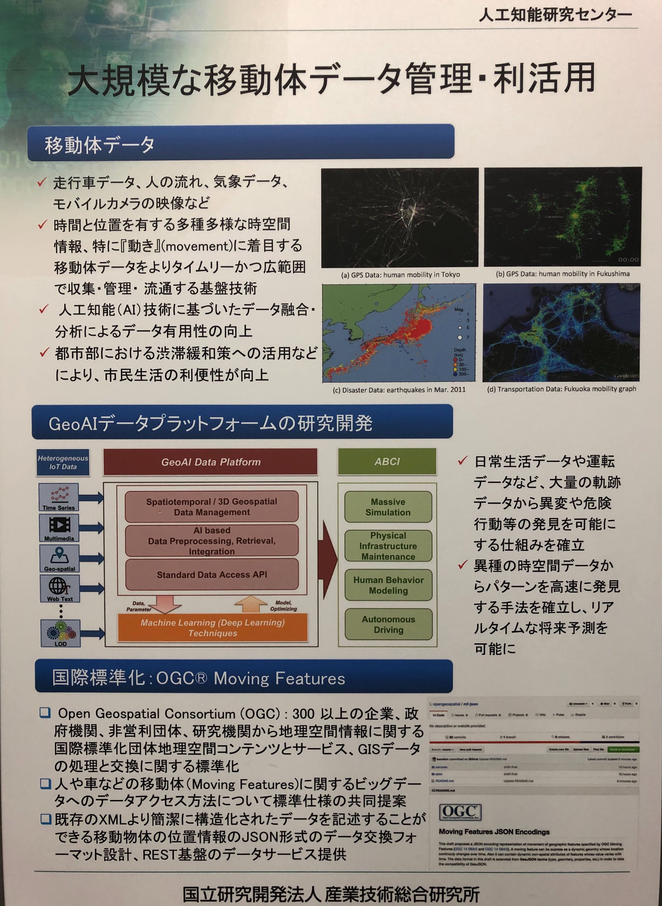

## LBJ 2019 Exhibit
[Location Business Japan (LBJ)](https://www.f2ff.jp/2019/lbj/) @MMakuhari Messe, Chiba, 6/12-14, 2019
<br>Largest event in Japan to gain business opportunities in location technology.

<p align="center"></p>
** Fig 1. Team Demo Poster. **

## References
The implementation of applied predictive model is based on the papers listed below:
```
@inproceedings{zhang2017deep,
  title={Deep spatio-temporal residual networks for citywide crowd flows prediction},
  author={Zhang, Junbo and Zheng, Yu and Qi, Dekang},
  booktitle={Thirty-First AAAI Conference on Artificial Intelligence},
  year={2017}
}

@inproceedings{xingjian2015convolutional,
  title={Convolutional LSTM network: A machine learning approach for precipitation nowcasting},
  author={Xingjian, SHI and Chen, Zhourong and Wang, Hao and Yeung, Dit-Yan and Wong, Wai-Kin and Woo, Wang-chun},
  booktitle={Advances in neural information processing systems},
  pages={802--810},
  year={2015}
}
```
